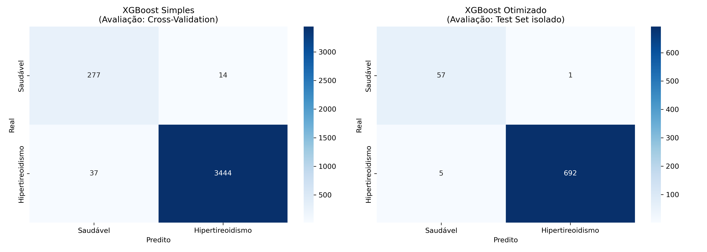
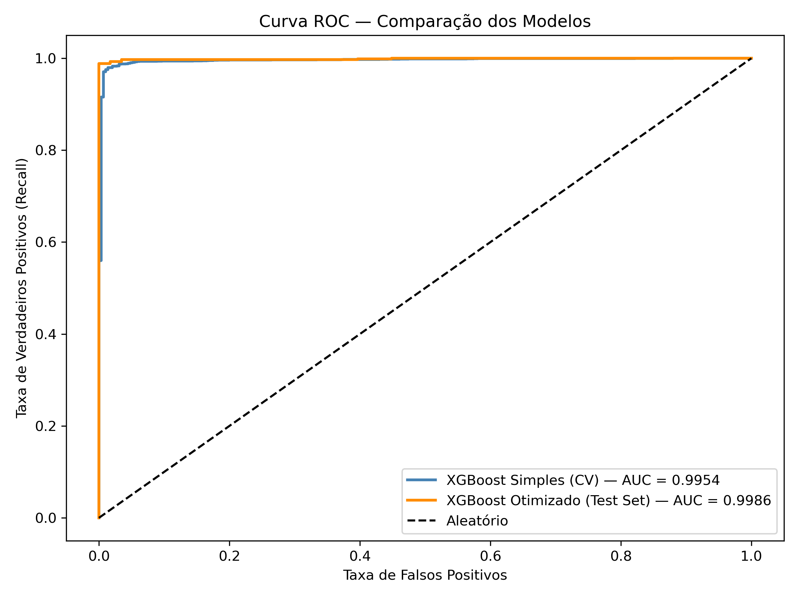
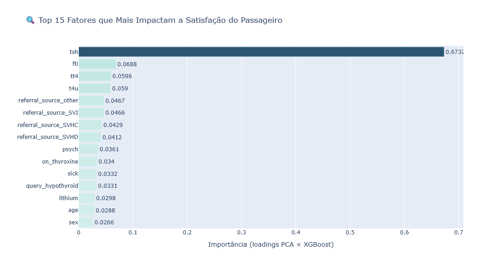

# 🩺 Predição de Hipertireoidismo

> Modelo preditivo para identificação de hipertireoidismo a partir de dados clínicos e laboratoriais, com foco na maximização da detecção de casos positivos — desenvolvido como projeto final do curso Profissão Cientista de Dados (EBAC).

## 📋 Sumário

- [Nome do Projeto](#nome-do-projeto)
- [Contexto / Problema do Negócio](#contexto--problema-do-negócio)
- [Objetivo](#objetivo)
- [Estrutura do Projeto](#estrutura-do-projeto)
- [Coleta de Dados](#coleta-de-dados)
- [Modelagem](#modelagem)
- [Resultados](#resultados)
- [Conclusões e Próximos Passos](#conclusões-e-próximos-passos)
- [Pré-requisitos](#pré-requisitos)
- [Instalação](#instalação)
- [Contato](#contato)
- [Licença](#licença)


## Nome do Projeto

**Predição de Hipertireoidismo: Análise de Dados Clínicos e Laboratoriais para Apoio ao Diagnóstico**


## Contexto / Problema do Negócio

O hipertireoidismo é uma disfunção endócrina caracterizada pela produção excessiva de hormônios tireoidianos, afetando diretamente o metabolismo, o sistema cardiovascular e a qualidade de vida do paciente. O diagnóstico tardio é um problema relevante de saúde pública:

- O hipertireoidismo afeta **cerca de 1,2% da população mundial**, com maior incidência em mulheres
- Sintomas como taquicardia, perda de peso e ansiedade são frequentemente **confundidos com outras condições**, atrasando o diagnóstico
- A doença não tratada aumenta significativamente o risco de **fibrilação atrial, osteoporose e crise tireotóxica**
- O rastreamento laboratorial convencional depende da **disponibilidade e interpretação conjunta de múltiplos exames**, o que pode ser limitante em contextos de atenção primária

A aplicação de modelos de machine learning sobre dados clínicos e laboratoriais oferece uma alternativa para **apoiar a triagem de pacientes em risco**, auxiliando profissionais de saúde na priorização de investigações diagnósticas.

**A dor:** profissionais de saúde lidam com grande volume de exames e dados clínicos. Um modelo preditivo capaz de sinalizar automaticamente pacientes com alto risco de hipertireoidismo pode reduzir atrasos diagnósticos e direcionar recursos de forma mais eficiente.


## Objetivo

1. **Prever a presença de hipertireoidismo** (Positivo vs. Negativo) com base em variáveis clínicas, laboratoriais e demográficas.
2. **Maximizar a detecção de casos positivos** — minimizando falsos negativos, ou seja, pacientes doentes não identificados pelo modelo.
3. **Identificar os marcadores laboratoriais mais relevantes** para a predição, contribuindo para a compreensão clínica da doença.

**Perguntas respondidas pelo projeto:**
- Quais exames laboratoriais têm maior poder preditivo para hipertireoidismo?
- Variáveis demográficas como idade e sexo influenciam a predição?
- Qual modelo oferece melhor desempenho considerando a prioridade de recall sobre a classe positiva?


## Estrutura do Projeto

```
.
├── apresentação/
│   └── Apresentação Predição de Hipertiroidismo.pdf    # PDF com a apresentação do projeto
├── data/
│   └── Base_M43_Pratique_Hypothyroid.csv    # Dataset utilizado
├── imagens/
│   ├── barras-target.png  
│   ├── comparacao_confusion_matrix.png       
│   ├── comparacao_metricas.png
│   ├── comparacao_roc.png
│   ├── features.png
│   └── mediana-tsh-por-target.png
├── src/
│   ├── data_utils.py                         # Funções de tratamento e análise dos dados
│   ├── plot_utils.py                         # Funções de visualização reutilizáveis
│   └── model_utils.py                        # Pipelines, cross-validation e avaliação dos modelos
├── predicao-hipertireodismo.ipynb            # Notebook principal com toda a análise
└── README.md
```


## Coleta de Dados

| Característica | Detalhe |
|---|---|
| **Fonte** | Base clínica adaptada do UCI Thyroid Disease Dataset |
| **Arquivo** | `Base_M43_Pratique_Hypothyroid.csv` |
| **Volume** | ~3.772 registros (treino) + ~755 registros (teste) |
| **Granularidade** | 1 linha por paciente avaliado |
| **Variável alvo** | `binaryclass` — binária: `P` (Positivo) / `N` (Negativo) |

### Principais variáveis

**Dados demográficos:**
`age`, `sex`

**Histórico clínico e medicações:**
`on_thyroxine`, `query_on_thyroxine`, `on_antithyroid_medication`*, `sick`, `pregnant`, `thyroid_surgery`*, `I131_treatment`*, `query_hypothyroid`, `query_hyperthyroid`*, `lithium`, `goitre`, `tumor`, `hypopituitary`, `psych`

**Exames laboratoriais:**
`TSH`, `T3`, `TT4`, `T4U`, `FTI`

**Encaminhamento:**
`referral_source`

> ⚠️ *Colunas marcadas com asterisco foram identificadas como **data leakage** e removidas antes da modelagem, pois representam informações disponíveis apenas após o diagnóstico (tratamentos já iniciados ou suspeitas clínicas registradas post-hoc).*

### Tratamento aplicado

**Valores ausentes:**
- Variáveis laboratoriais (`TSH`, `T3`, `TT4`, `T4U`, `FTI`, `TBG`): valores ausentes (`?`) tratados com base na coluna flag correspondente (`_measured`) — quando o exame não foi realizado, o valor foi mantido como ausente estrutural e tratado no pipeline
- `age`: valor inválido (`455`) substituído pela mediana dos demais registros; valores `?` substituídos por `0` antes da conversão de tipo
- `sex`: valores ausentes imputados com base na mediana de `TBG` — mulheres apresentam naturalmente TBG mais elevada devido ao estrogênio, tornando esse marcador biologicamente adequado para a imputação

**Tipagem e encoding:**
- Variáveis booleanas (`'t'`/`'f'`): convertidas para `True`/`False`
- `sex`: `LabelEncoder`
- `binaryclass`: mapeamento direto `{'N': 0, 'P': 1}`
- `referral_source`: `get_dummies` com `drop_first=True`

**Remoção de variáveis:**
- Colunas flag redundantes removidas após uso na imputação: `tsh_measured`, `t3_measured`, `tt4_measured`, `t4u_measured`, `fti_measured`, `tbg_measured`
- `TBG` removida: alta proporção de ausência estrutural após tratamento
- Colunas com **data leakage** removidas: `query_hyperthyroid`, `on_antithyroid_medication`, `i131_treatment`, `thyroid_surgery`

**Outliers:**
- Valores extremos em `TSH`, `T3`, `TT4` e `FTI` **mantidos** — representam o padrão hormonal de pacientes com disfunção tireoidiana, sendo clinicamente relevantes para a predição
- Único ajuste realizado: substituição do registro `age = 455` por mediana


## Modelagem

### Pipeline adotado

```
Dados brutos → Encoding → Remoção de leakage → Separação Train/Test
→ RobustScaler → PCA → XGBoost → Avaliação
```

Os modelos foram encapsulados em **pipelines do scikit-learn** com `RobustScaler` (robusto a outliers dos exames laboratoriais) e **PCA** para redução de dimensionalidade.

### Separação de dados

| Conjunto | Tamanho | Uso |
|---|---|---|
| `X_train / Y_train` | ~3.772 registros (80%) | Treinamento e cross-validation |
| `X_test / Y_test` | ~755 registros (20%) | Avaliação final isolada |

> A separação foi realizada com `stratify=Y` para preservar a proporção de classes em ambos os conjuntos.

### Redução de dimensionalidade (PCA)

Análise exploratória com PCA sobre as features selecionadas:

| Componentes | Variância Acumulada |
|---|---|
| Ponto de inflexão | ~90% |
| n_components utilizado | **21** (variância total das features selecionadas) |

Os modelos foram treinados com `n_components=21`, preservando toda a variância do conjunto de features após a remoção das colunas de leakage e redundantes.

### Modelos treinados

| Modelo | Configuração | Avaliação |
|---|---|---|
| XGBoost | Sem hiperparâmetros | Cross-Validation (5 folds, dataset inteiro) |
| **XGBoost** | **Com hiperparâmetros** ⭐ | **GridSearchCV no X_train → `.predict()` no X_test** |

> **Nota metodológica:** os dois modelos foram avaliados com abordagens distintas. O modelo simples utilizou validação cruzada sobre o dataset completo (sem risco de contaminação, pois não há tuning de hiperparâmetros). O modelo otimizado utilizou `GridSearchCV` exclusivamente sobre `X_train`, garantindo que o `X_test` permanecesse completamente inédito para a avaliação final.

### Hiperparâmetros — XGBoost Otimizado

A busca foi realizada de forma incremental para controle do custo computacional, testando um parâmetro por vez antes de fixar o valor ideal. Os melhores parâmetros encontrados foram:

| Parâmetro | Valor |
|---|---|
| `pca__n_components` | 21 |
| `modelo__learning_rate` | 0.3 |
| `modelo__max_depth` | 6 |
| `modelo__n_estimators` | 100 |
| `modelo__subsample` | 1.0 |
| `modelo__colsample_bytree` | 0.8 |

**Métrica de otimização:** `recall` — alinhada ao objetivo de maximizar a identificação de pacientes com hipertireoidismo.


## Resultados

### Comparativo de modelos

> ⭐ **Melhor modelo: XGBoost com hiperparâmetros**

| Modelo | Avaliação | Accuracy | Precision | Recall | F1-Score |
|---|---|---|---|---|---|
| XGBoost (sem hiper) | Cross-Validation | — | — | — | — |
| **XGBoost (com hiper)** | **Test Set isolado** | **—** | **1.00** | **0.99** | **—** |

> Os valores exatos de cada métrica são exibidos nos gráficos e tabelas do notebook.

### Comparação Visual dos Modelos


### Matrizes de Confusão



### Curva ROC



### Principais descobertas

> 💡 **Insight 1 — TSH é o marcador dominante:** O hormônio estimulante da tireoide apresentou a maior importância preditiva no modelo. Esse resultado é clinicamente esperado: o TSH é suprimido de forma expressiva em pacientes com hipertireoidismo, tornando-se o marcador laboratorial mais discriminativo para a condição.

> 💡 **Insight 2 — Padrão hormonal completo reforça a predição:** FTI, TT4 e T3 aparecem como as features seguintes em importância, refletindo o padrão de elevação hormonal característico do hipertireoidismo. A combinação desses quatro marcadores forma a base do diagnóstico laboratorial da doença.

> 💡 **Insight 3 — Fatores demográficos não são determinantes:** Idade e sexo não apresentaram contribuição relevante para a predição. O perfil hormonal do paciente, independentemente de características individuais, é o principal determinante do diagnóstico — o que reforça a adequação da abordagem laboratorial como critério de triagem.

> 💡 **Insight 4 — Alta precisão diagnóstica:** O modelo otimizado atingiu Precision = 1.00 e Recall = 0.99 sobre o conjunto de teste isolado, indicando que todos os casos classificados como positivos foram confirmados, e 99% dos pacientes doentes foram corretamente identificados.


## Conclusões e Próximos Passos

### Conclusão

O XGBoost com hiperparâmetros otimizados via `GridSearchCV` foi o modelo com melhor desempenho preditivo, atingindo Recall de 0.99 e Precision de 1.00 sobre o conjunto de teste. A análise de importância de features confirmou que o diagnóstico de hipertireoidismo é determinado predominantemente pelo perfil hormonal — especialmente TSH, FTI, TT4 e T3 —, enquanto variáveis demográficas como idade e sexo não exercem influência relevante sobre a predição.

Os cinco fatores mais determinantes identificados pelo modelo (Feature Importance — XGBoost), em ordem de importância, são:

1. 🥇 **TSH** — Hormônio Estimulante da Tireoide
2. 🥈 **FTI** — Índice de Tiroxina Livre
3. 🥉 **TT4** — Tiroxina Total
4. **T3** — Triiodotironina
5. **T4U** — Captação de T4

### Importância das Variáveis no XGBoost



Esses resultados estão alinhados com o protocolo clínico de investigação do hipertireoidismo, que tem o TSH como exame de primeira linha. O modelo demonstra capacidade de replicar o raciocínio diagnóstico laboratorial, podendo atuar como ferramenta de apoio à triagem automatizada em contextos de atenção primária ou análise de grandes volumes de dados clínicos.

### Limitações

- O dataset é de origem acadêmica e pode não refletir a variabilidade de uma população clínica real
- O PCA reduz a interpretabilidade direta — as importâncias de feature são estimadas via contribuição dos componentes principais
- O modelo foi treinado em dados de corte único, sem dimensão temporal

### Próximos Passos

- [ ] Testar outros algoritmos como LightGBM e SVM para comparação de performance
- [ ] Aplicar SHAP values para interpretabilidade mais granular dos casos individuais
- [ ] Desenvolver API de inferência com FastAPI para servir o modelo em produção
- [ ] Ampliar o dataset com fontes clínicas reais para validação externa


## Pré-requisitos

- Python 3.10 ou superior
- pip ou conda


## Instalação

```bash
# Clone o repositório
git clone https://github.com/SantosBruna/predicao-hipertireoidismo.git
cd predicao-hipertireoidismo

# Crie um ambiente virtual
python -m venv venv
source venv/bin/activate   # Linux/Mac
# venv\Scripts\activate    # Windows

# Instale as dependências
pip install -r requirements.txt
```

**Principais dependências:**
```
pandas
numpy
scikit-learn
xgboost
plotly
seaborn
matplotlib
```


## Contato

**Bruna S. R. Santos**
- 💼 [LinkedIn](https://www.linkedin.com/in/brunasrsantos)
- 📧 Email: brunasrsantos@gmail.com


## Licença

Este projeto está licenciado sob a licença MIT. Veja [LICENSE](LICENSE) para mais detalhes.
